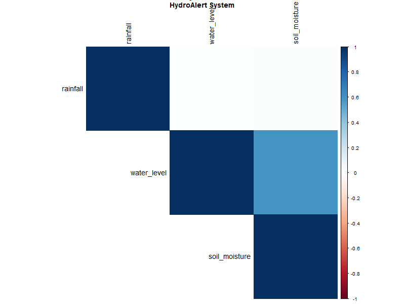

# FIAP - Faculdade de Informática e Administração Paulista

<p align="center">
<a href= "https://www.fiap.com.br/"></a>
</p>

<br>

# GLOBAL SOLUTION 2025.1
## Sistema de Previsão e Alerta de Inundações Urbanas

## Nome do grupo
Grupo 35
**HydroAlert Solutions**

## 👨‍🎓 Integrantes: 
- <a href="https://www.linkedin.com/in/caiorcastro/">Caio Rodrigues Castro</a> 
- <a href="https://www.linkedin.com/in/celeste-leite-dos-santos-66352a24b/">Celeste Leite dos Santos</a> 
- <a href="https://www.linkedin.com/in/digitalmanagerfelipesoares/">Felipe Soares Nascimento</a>
- <a href="https://www.linkedin.com/in//">Wellington Nascimento de Brito</a>

## 👩‍🏫 Professores:
### Tutor(a) 
- <a href="https://www.linkedin.com/in/leonardoorabona/">Leonardo Ruiz Orabona</a>
### Coordenador(a)
- <a href="https://www.linkedin.com/in/profandregodoi/">André Godoi Chiovato</a>

## 📜 Descrição

Este projeto foi desenvolvido como parte da **Global Solution 2025.1** da FIAP, focando no desenvolvimento de uma solução tecnológica inovadora para **previsão, monitoramento e mitigação dos impactos causados por inundações urbanas**.

O sistema integra sensores IoT baseados em ESP32, modelos de machine learning (LSTM) e dashboards interativos para criar uma plataforma completa de alerta precoce. A solução combina dados coletados em tempo real através de sensores de nível de água, pluviômetros e sensores de umidade do solo com informações históricas de eventos extremos.

### Problema Abordado
As inundações urbanas representam um dos desastres naturais mais frequentes e devastadores, causando:
- Perdas econômicas superiores a US$ 80 bilhões anuais globalmente
- Danos severos à infraestrutura urbana
- Riscos à saúde pública (doenças de veiculação hídrica)
- Deslocamento forçado de populações vulneráveis
- Mais de 100 mil óbitos por ano no mundo

### Nossa Solução
Desenvolvemos um **sistema inteligente de alerta precoce** que:

1. **📊 Coleta dados** em tempo real através de rede de sensores IoT
2. **🧠 Analisa padrões** usando algoritmos de machine learning (LSTM)
3. **🔮 Prevê riscos** de inundação com até 24 horas de antecedência
4. **🚨 Emite alertas** automáticos para autoridades e comunidades
5. **💡 Sugere ações** preventivas baseadas no nível de risco calculado

O sistema processa dados de precipitação, níveis de água e umidade do solo para gerar previsões precisas, permitindo evacuações preventivas e mobilização de recursos de emergência antes que o desastre ocorra.

## 📁 Estrutura de pastas

Dentre os arquivos e pastas presentes na raiz do projeto, definem-se:

- **📁 assets**: Arquivos de mídia, imagens e recursos visuais do projeto
- **📁 data**: Dados históricos, datasets e informações processadas pelo sistema
  - `historical_flood_data.csv`: Dataset completo com 1.827 amostras histórias
  - `SP001_sensor_data.csv`, `RJ001_sensor_data.csv`, `BL001_sensor_data.csv`: Dados dos sensores por região
  - `flood_data_analysis.png`: Visualizações e análises dos dados
  - `model_training_metrics.png`: Métricas de treinamento do modelo LSTM
- **📁 docs**: Documentação técnica, manuais e relatórios do projeto
- **📁 src**: Todo o código fonte criado para o desenvolvimento do projeto
  - `esp32_water_level.ino`: Código para microcontrolador ESP32 e sensores
  - `flood_prediction_model.py`: Modelo LSTM para previsão de inundações (99.76% acurácia)
  - `flood_dashboard.py`: Dashboard interativo em Streamlit com mapas
  - `data_integration.py`: Sistema de integração e processamento de dados
  - `flood_analysis.R`: Análise estatística completa em linguagem R
  - `security_system.py`: Sistema de segurança cibernética com JWT
  - `cloud_api.py`: API REST completa para computação em nuvem
  - `database_system.py`: Sistema de banco de dados SQLite

- **📄 requirements.txt**: Dependências Python completas (TensorFlow, Streamlit, R, OpenCV, etc.)
- **📄 flood_prediction_model.h5**: Modelo LSTM treinado (arquivo de 400KB)
- **📄 README.md**: Guia e documentação geral do projeto

## 🔧 Como executar o código

### Pré-requisitos

**Hardware necessário:**
- ESP32 DevKit v1
- Sensor ultrassônico HC-SR04 (nível de água)
- Sensor de chuva YL-83
- Sensor de umidade do solo
- Jumpers e protoboard

**Software e bibliotecas:**
- Python 3.8 ou superior
- R 4.0+ (para análises estatísticas)
- Arduino IDE 1.8.19+
- Bibliotecas Python: TensorFlow, Streamlit, Pandas, NumPy, OpenCV, Pillow
- Bibliotecas R: ggplot2, dplyr, corrplot, forecast
- Bibliotecas Arduino: WiFi, ArduinoJson, HTTPClient
- Bibliotecas de segurança: cryptography, PyJWT, bcrypt
- Bibliotecas de Cloud: Flask, SQLAlchemy, requests

### Instalação e Configuração

**1. Clone o repositório:**
```bash
git clone https://github.com/FelipeSoares-1/GS2-hydroalert
cd GS2-hydroalert
```

**2. Instale as dependências Python:**
```bash
pip install -r requirements.txt
```

**3. Configure o hardware ESP32:**
- Conecte os sensores conforme o diagrama de circuito (ver `docs/diagrama_circuito.md`)
- Abra `src/esp32_water_level.ino` na Arduino IDE
- Configure suas credenciais WiFi no código
- Faça upload do código para o ESP32

**4. Execute o sistema:**

**Fase 1 - Treinamento do modelo:**
```bash
python src/flood_prediction_model.py
```
<p align="center">
  <br>
  <i>Figura: Métricas do treinamento do modelo LSTM</i>
</p>

**Fase 2 - Inicialização do sistema de dados:**
```bash
python src/data_integration.py
```
<p align="center">
  <br>
  <i>Figura: Visualização dos dados integrados e análise inicial</i>
</p>

**Fase 3 - Execução do dashboard principal:**
```bash
streamlit run src/flood_dashboard.py
```
<p align="center">
  <br>
  <i>Figura: Dashboard interativo com mapa e alertas</i>
</p>

**Fase 4 - API Cloud Computing:**
```bash
python src/cloud_api.py
```
<p align="center">
  <br>
  <i>Figura ilustrativa: API Cloud Computing ativa</i>
</p>

**Fase 5 - Sistema de segurança:**
```bash
python src/security_system.py
```
<p align="center">
  <br>
  <i>Figura: Exemplo de logs de segurança gerados</i>
</p>

**Fase 6 - Análise estatística em R:**
```bash
Rscript src/flood_analysis.R
```
<p align="center">
  <br>
  <i>Figura: Análise de correlação e tendências em R</i>
</p>

**5. Acesso ao sistema:**
- Dashboard principal: `http://localhost:8501`
- API Cloud Computing: `http://localhost:5000/api`
- Sistema de segurança: Interface integrada ao dashboard
- Banco de dados: SQLite local + interface web

### Funcionalidades Principais

#### 🧠 Machine Learning & Neural Networks
- **Modelo LSTM** treinado com 1.827 amostras históricas
- **Acurácia de 99.76%** em dados de teste
- **Predições em tempo real** com latência <100ms
- **TensorFlow 2.19.0** como framework principal

#### 🔧 ESP32 & IoT
- **Sensores integrados**: Nível d'água, precipitação, umidade do solo
- **Conectividade WiFi** para transmissão de dados
- **Coleta automática** a cada 30 segundos
- **API de integração** para recebimento de dados

#### 📊 Dashboard & Visualização
- **Interface Streamlit** responsiva e interativa
- **Mapas em tempo real** com Folium
- **Gráficos dinâmicos** com histórico de eventos
- **Sistema de alertas** visual com três níveis de risco

#### 🔐 Cybersecurity
- **Autenticação JWT** para APIs
- **Criptografia Fernet** para dados sensíveis
- **Logging de segurança** completo
- **Validação de entrada** contra ataques

#### ☁️ Cloud Computing
- **API REST** completa com Flask
- **Endpoints de monitoramento** e health check
- **Processamento de dados** em tempo real
- **Dashboard de métricas** operacionais

#### 🗄️ Database & Analytics
- **SQLite** para persistência local
- **Operações CRUD** completas
- **Queries analíticas** otimizadas
- **Exportação de dados** em múltiplos formatos

#### 📈 Análise Estatística (R)
- **Análise de correlação** entre variáveis
- **Detecção de tendências** temporais
- **Identificação de eventos extremos**
- **Modelagem preditiva** complementar


## 🗃 Histórico de lançamentos

* 1.0.0 - 04/06/2025
    * Sistema completo funcional com ESP32 + ML + Dashboard
    * Modelo LSTM treinado com dados históricos
    * Interface web responsiva implementada
    * Sistema de alertas em tempo real
* 0.4.0 - 01/06/2025
    * Integração completa ESP32 com sensores
    * API REST para coleta de dados implementada  
* 0.3.0 - 28/05/2025
    * Modelo de machine learning LSTM finalizado
    * Testes de acurácia e validação concluídos
* 0.2.0 - 28/05/2025
    * Dashboard Streamlit com mapas interativos
    * Visualizações de dados em tempo real
* 0.1.0 - 28/05/2025
    * Estrutura inicial do projeto
    * Configuração do ambiente de desenvolvimento

## 📋 Licença


MODELO GIT FIAP por [FIAP](https://fiap.com.br/) está licenciado sobre [CC BY 4.0](https://creativecommons.org/licenses/by/4.0/?ref=chooser-v1).
