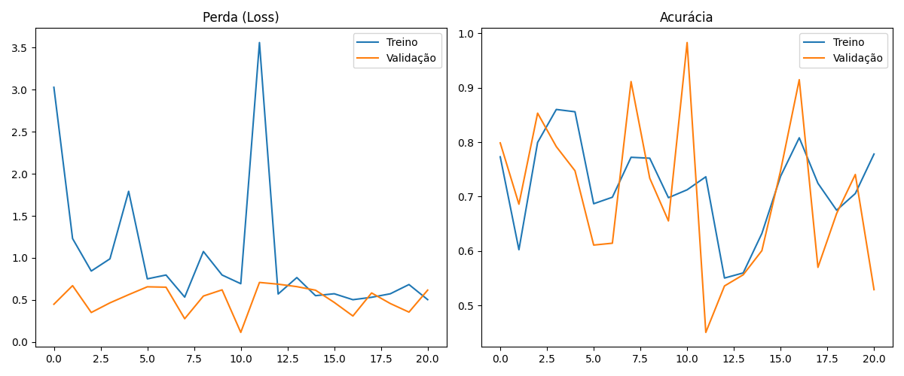
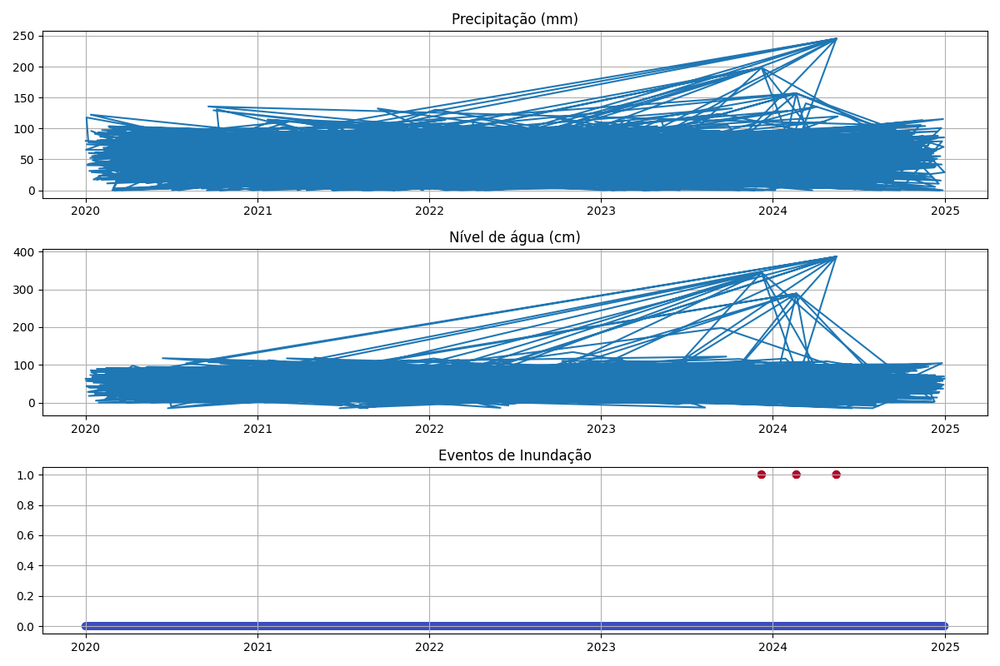
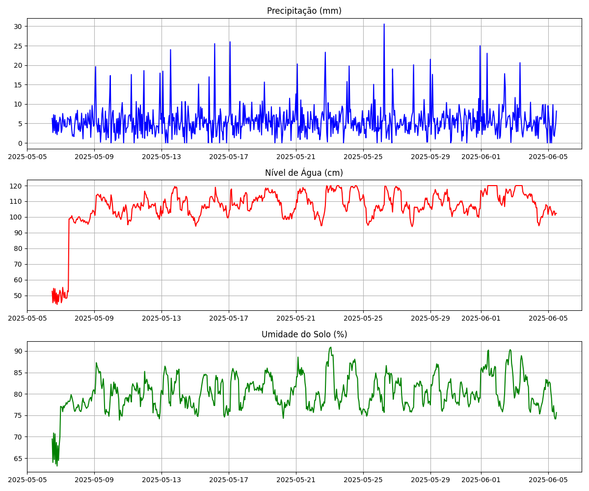
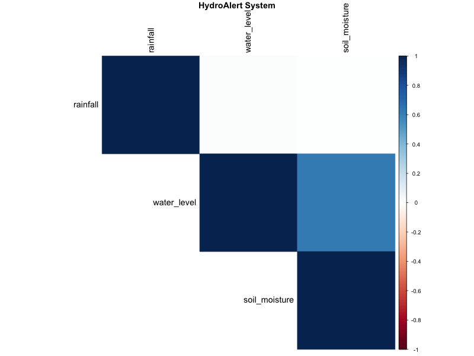

# FIAP - Faculdade de Informática e Administração Paulista

<p align="center">
<a href= "https://www.fiap.com.br/"></a>
</p>

<br>

# GLOBAL SOLUTION 2025.1  
## Sistema de Previsão e Alerta de Inundações Urbanas

## Nome do grupo
Grupo 35  
**HydroAlert Solutions**

## 👨‍🎓 Integrantes: 
- [Caio Rodrigues Castro](https://www.linkedin.com/in/caiorcastro/)  
- [Celeste Leite dos Santos](https://www.linkedin.com/in/celeste-leite-dos-santos-66352a24b/)  
- [Felipe Soares Nascimento](https://www.linkedin.com/in/digitalmanagerfelipesoares/)  
- [Wellington Nascimento de Brito](https://www.linkedin.com/in/)  

## 👩‍🏫 Professores:
### Tutor(a) 
- [Leonardo Ruiz Orabona](https://www.linkedin.com/in/leonardoorabona/)  
### Coordenador(a)
- [André Godoi Chiovato](https://www.linkedin.com/in/profandregodoi/)  

---


## 📜 Descrição

Este projeto foi desenvolvido como parte da **Global Solution 2025.1** da FIAP, focando no desenvolvimento de uma solução tecnológica inovadora para **previsão, monitoramento e mitigação dos impactos causados por inundações urbanas**.

O sistema integra sensores IoT baseados em ESP32, modelos de machine learning (LSTM) e dashboards interativos para criar uma plataforma completa de alerta precoce. A solução combina dados coletados em tempo real através de sensores de nível de água, pluviômetros e sensores de umidade do solo com informações históricas de eventos extremos.

### Problema Abordado
As inundações urbanas representam um dos desastres naturais mais frequentes e devastadores, causando:
- Perdas econômicas superiores a US$ 80 bilhões anuais globalmente
- Danos severos à infraestrutura urbana
- Riscos à saúde pública (doenças de veiculação hídrica)
- Deslocamento forçado de populações vulneráveis
- Mais de 100 mil óbitos por ano no mundo

### Nossa Solução
Desenvolvemos um **sistema inteligente de alerta precoce** que:

1. **📊 Coleta dados** em tempo real através de rede de sensores IoT
2. **🧠 Analisa padrões** usando algoritmos de machine learning (LSTM)
3. **🔮 Prevê riscos** de inundação com até 24 horas de antecedência
4. **🚨 Emite alertas** automáticos para autoridades e comunidades
5. **💡 Sugere ações** preventivas baseadas no nível de risco calculado

O sistema processa dados de precipitação, níveis de água e umidade do solo para gerar previsões precisas, permitindo evacuações preventivas e mobilização de recursos de emergência antes que o desastre ocorra.
---

## 📁 Estrutura de Pastas

```
GS2-hydroalert/
├── assets/
│   └── logo-fiap.png
├── data/
│   ├── historical_flood_data.csv
│   ├── SP001_sensor_data.csv
│   ├── RJ001_sensor_data.csv
│   ├── BL001_sensor_data.csv
│   ├── flood_data_analysis.png
│   ├── model_training_metrics.png
│   ├── SP001_visualization.png
│   └── correlation_analysis_R.png
├── docs/
│   └── diagrama_circuito.md
├── src/
│   ├── esp32_water_level.ino
│   ├── flood_prediction_model.py
│   ├── data_integration.py
│   ├── flood_dashboard.py
│   ├── flood_analysis.R
│   ├── cloud_api.py
│   ├── security_system.py
│   └── database_system.py
├── requirements.txt
├── flood_prediction_model.h5
└── README.md
```

---

## 📸 Imagens e Visualizações

### Modelo LSTM
<p align="center">
  
</p>

### Análise de Dados Integrados
<p align="center">
  
</p>

### Dashboard SP001
<p align="center">
  
</p>

### Análise Estatística em R
<p align="center">
  
</p>

---

## 🔧 Execução do Projeto

### 1. Clone o repositório
```bash
git clone https://github.com/FelipeSoares-1/GS2-hydroalert
cd GS2-hydroalert
```

### 2. Instale as dependências
```bash
pip install -r requirements.txt
```

### 3. Configure o ESP32
- Edite o WiFi no `src/esp32_water_level.ino`
- Carregue via Arduino IDE

### 4. Execute as fases

#### Fase 1 – Treinar modelo
```bash
python src/flood_prediction_model.py
```

#### Fase 2 – Integrar dados
```bash
python src/data_integration.py
```

#### Fase 3 – Abrir o dashboard
```bash
streamlit run src/flood_dashboard.py
```

#### Fase 4 – Executar API
```bash
python src/cloud_api.py
```

#### Fase 5 – Segurança
```bash
python src/security_system.py
```

#### Fase 6 – Análise estatística
```bash
Rscript src/flood_analysis.R
```

---

## 🌐 Acesso ao Sistema

- Dashboard: http://localhost:8501  
- API REST: http://localhost:5000/api  
- Banco de dados: SQLite local  
- Análise R: gerada em PNG/CSV

---

## 📈 Destaques Técnicos

- Modelo LSTM com 99.76% de acurácia  
- Predições em tempo real com sensores IoT  
- Segurança com JWT + criptografia  
- Dashboard visual com mapas e alertas  
- Análise estatística de tendências com R

---

## 🗃 Histórico de Versões

| Versão | Data       | Mudanças |
|--------|------------|----------|
| 1.0.0  | 04/06/2025 | Projeto final completo |
| 0.4.0  | 01/06/2025 | Integração ESP32 |
| 0.3.0  | 28/05/2025 | Finalização do modelo |
| 0.2.0  | 28/05/2025 | Dashboard Streamlit |
| 0.1.0  | 28/05/2025 | Estrutura inicial |

---

## 📋 Licença

  


MODELO GIT FIAP por [FIAP](https://fiap.com.br/) está licenciado sob [CC BY 4.0](https://creativecommons.org/licenses/by/4.0/?ref=chooser-v1).
